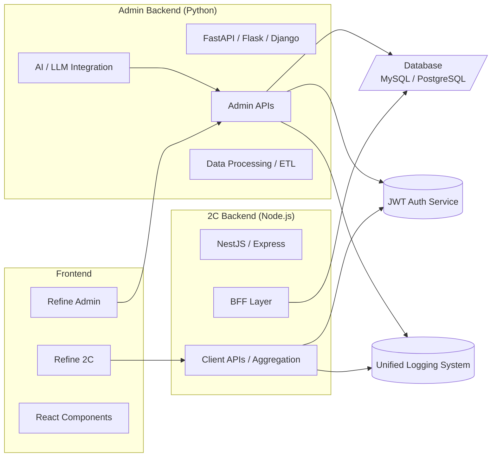

# LingAdmin Fullstack Edition  
## 技术选型与架构说明（Technical Decision Document）

本文件为 **LingAdmin Fullstack Edition 的技术选型与架构说明**，用于对外展示项目的设计理念、技术栈选择理由、架构结构及未来可扩展性。  
该文档适合作为 GitHub 仓库的核心架构文档或 ADR（Architecture Decision Record）。

---

# 1. 设计目标（Design Goals）

LingAdmin Fullstack Edition 的目标是：

- **展示现代全栈架构能力**：Python + Node.js + React + Refine  
- **根据业务访问模式选择最优技术栈**（2Admin 与 2C 不同）  
- **支持数据驱动发展与 AI 能力注入**（Python 侧）  
- **支持前后端统一语言与 Fullstack 开发体验**（Node.js 侧）  
- **提供可演化为微服务体系的基础架构**  
- **作为学习、面试、开源展示的优质示例项目**

---

# 2. 整体架构（Architecture Overview）



---

# 3. 技术选型（Tech Stack Decisions）

LingAdmin 选用 **Python 作为 Admin 后端**、**Node.js 作为 2C 后端**，是基于业务模式与技术生态综合考虑的结果。

## 3.1 Admin 使用 Python — 原因与价值

### Python 的核心优势
- 与 **大数据工具和平台天然兼容**：Pandas、Polars、Spark、Flink、Airflow  
- 拥有 **最成熟的 AI / LLM 工具链**：HuggingFace、OpenAI、LangChain、Llama  
- 非常适合处理 Admin 侧常见的任务：  
  - 报表与统计  
  - 批量数据处理（ETL）  
  - 自动化脚本  
  - 文本理解/生成（AI 驱动）  
- 更适合中后台的“批处理 + 逻辑复杂 + 数据依赖”场景

### Python Admin 的架构价值
> Python 让 LingAdmin 的后台天然具备“数据中台 + AI 中台”的能力，成为高阶管理系统的理想基础。

---

## 3.2 2C 使用 Node.js — 原因与价值

### Node.js 的核心优势
- **前后端语言统一（TypeScript 全链路）**  
- 非常适合高频、轻量 API  
- 擅长 BFF（Backend for Frontend）模式  
- 开发体验高效：  
  - Prisma / TypeORM  
  - Zod / Yup  
  - NestJS 强结构化模块  
- 与前端共享：  
  - 类型  
  - DTO  
  - 工具链  
  - 验证逻辑  

### Node.js 作为 2C 的价值
> Node.js 非常适合“客户端接口 + 聚合层 + 前端协作”，使 2C 系统的迭代效率与体验更优。

---

# 4. 2Admin 与 2C 的业务与访问模式差异

| 维度 | Admin（Python） | 2C（Node.js） |
|------|------------------|---------------|
| 用户角色 | 管理员 / 运营 | C 端用户 |
| 并发模式 | 低并发、高权限 | 高频访问、高并发 |
| 数据特点 | 数据密集、复杂逻辑 | 数据量小但频繁 |
| 核心职责 | 配置 / 审核 / 报表 / ETL / AI | API/BFF / 聚合 / 交互接口 |
| 技术最佳适配 | Python | Node.js |

---

# 5. 服务职责划分（Service Responsibilities）

## 5.1 Python Admin Backend
- 管理员登录与权限管理  
- 数据导入 / 导出  
- 报表统计、聚合查询  
- 批处理任务、定时任务  
- AI / LLM 能力接入  
- 配置管理、运营管理后台  

## 5.2 Node.js 2C Backend
- 客户端接口（REST / GraphQL）  
- BFF 层：服务聚合与裁剪  
- 低延迟数据读取  
- 用户侧业务逻辑  
- 与 React 前端高效协作  

## 5.3 共享基础设施
- 统一数据库结构  
- JWT 认证体系  
- 错误码与响应标准  
- JSON 日志规范  
- 缓存与消息队列（可扩展）

---

# 6. 技术选型的优点与缺点（Pros & Cons）

## 6.1 优点（Pros）

### ★ 1. 两种技术栈互补  
Python = 数据/AI 强项  
Node.js = Fullstack/BFF 强项

### ★ 2. 更契合不同访问模式  
- Admin：偏数据，低并发  
- 2C：偏交互，高并发  

### ★ 3. 展示真实企业级架构  
适合用于展示架构能力，而不是简单 CRUD 项目。

### ★ 4. 对个人成长价值极高  
完整覆盖：
- Python 后端  
- Node.js 后端  
- React/Refine 前端  
- 多技术栈协同模式  

### ★ 5. 更容易扩展为微服务  
可以继续加入 Go/Rust/Java 服务。

---

## 6.2 缺点（Cons）

### ⚠️ 1. 工程复杂度更高  
两个后端 → 两套依赖、部署、结构。

### ⚠️ 2. 模型需要保持一致  
User、Role 等基础模型需谨慎同步。

### ⚠️ 3. 需要统一规范（强纪律）  
API、错误码、日志规范必须统一。

### ⚠️ 4. 对贡献者门槛更高  
需理解 Python + Node + React。

---

# 7. 项目结构建议（Monorepo 推荐）

推荐使用 PNPM + TurboRepo / Nx：

```
lingadmin/
  apps/
    admin-backend-python/
    c-backend-node/
    admin-frontend/
    c-frontend/
  packages/
    shared-types/
    shared-config/
    shared-utils/
  docs/
    architecture/
```

---

# 8. 未来扩展方向（Future Enhancements）

- 引入 Go / Rust 微服务（计算密集任务）
- 增加消息队列（Kafka / Redis Streams）
- Node.js 增加 GraphQL Gateway
- Python 增加智能审核 / 推荐模型
- 引入统一监控系统（Prometheus + Grafana）
- 全链路 Tracing（OpenTelemetry）

---

# 9. 总结（Conclusion）

LingAdmin Fullstack Edition 并不是为了追求“最低复杂度”，而是一个：

> **刻意采用多技术栈、体现工程深度、同时练习 Python + Node + React 的架构展示项目。**

- Python → 数据 & AI 强项  
- Node.js → Fullstack & 高效协作强项  
- React + Refine → 快速构建前端管理界面  

最终实现：

**一个功能完善、技术全面、架构先进、展示价值极高的全栈开源项目。**

---

如需：  
- PDF 版本  
- 英文版  
- README 主项目介绍版  
- 更正式的 ADR 文档  
我可以继续为你生成。
